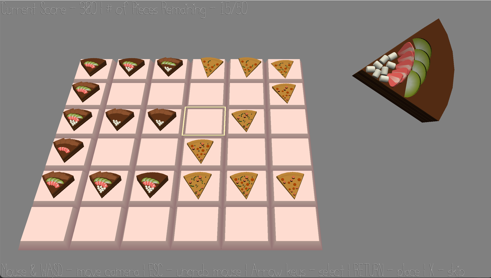

# Too EZ Pizza Cake

**Author**: Joanna Yao

**Design**: A tile placement strategy game but with delicious pizzas and cakes!

**Screen Shot**:

**How To Play**:

*Controls*: arrow keys to select tile, RETURN to place a piece, X to skip a piece.

*Rules*: a piece can only be placed if it shares at least two toppings with some (orthogonally) adjacent piece already on the board, or be (orthogonally) isolated; the more toppings a piece shares with neighboring pieces, the more score you will gain for that placement.

This game was built with [NEST](NEST.md).
